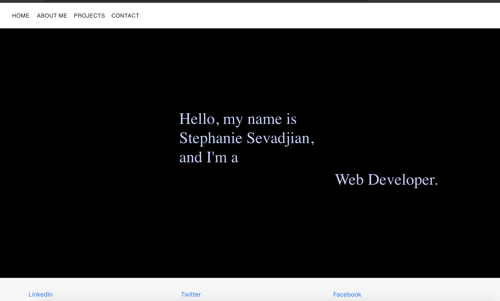
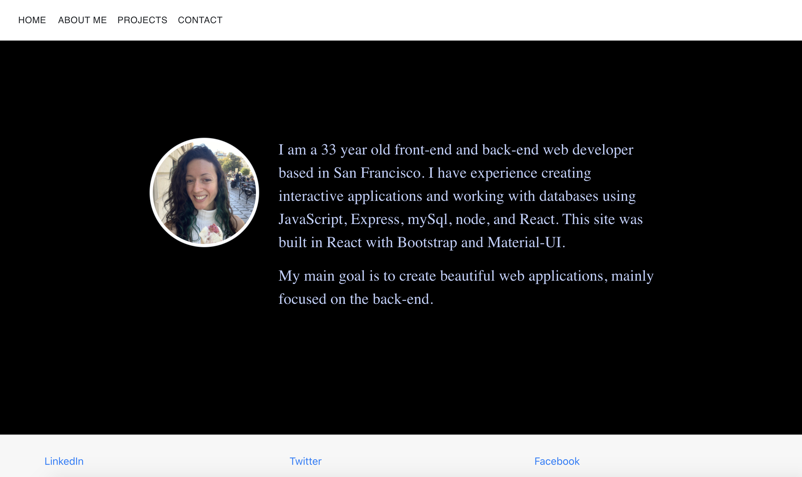
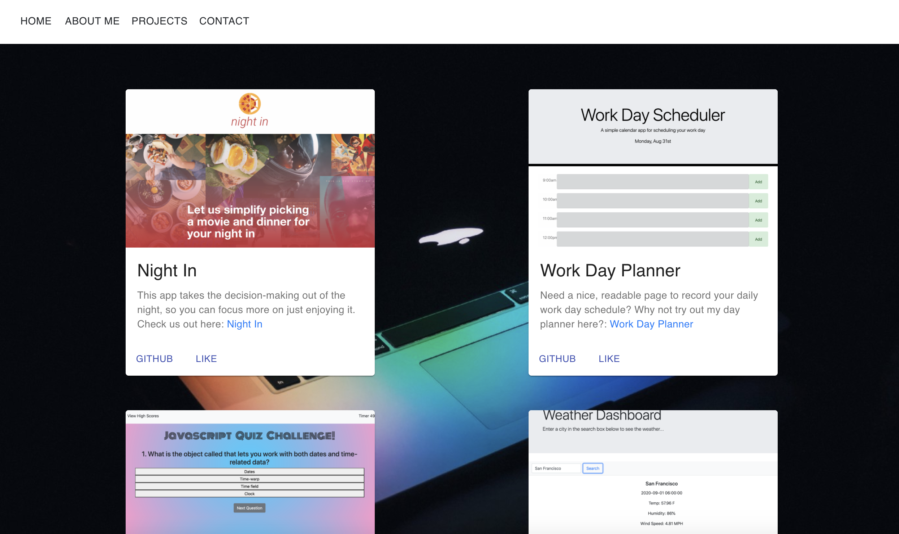
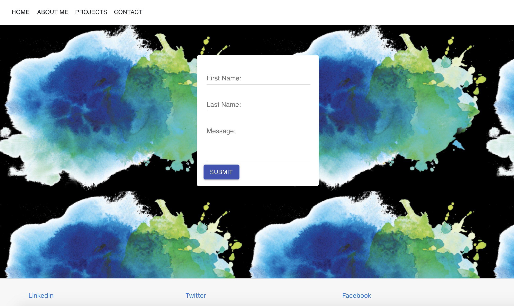

# Portfolio with React

## Description

This project was bootstrapped with [Create React App](https://github.com/facebook/create-react-app), and it utilizes both Bootstrap and Material UI. 

The app can be run in development mode by entering 'npm start' in the command line, and the live application is hosted on Heroku.

This web page will be used as a base for my real portfolio as I begin to create and develop my own applications and gain more skills to showcase.
 

## Screenshots

## Live Page Hosted on Heroku

https://mighty-taiga-36356.herokuapp.com/

## Link to GitHub Repo

https://github.com/ssevadjian/Portfolio-React
